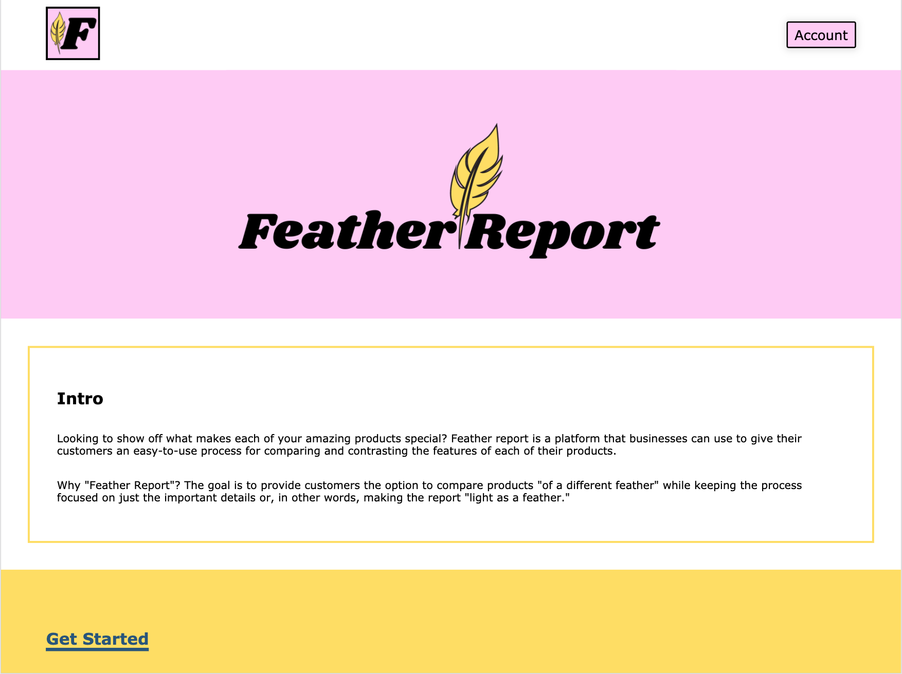
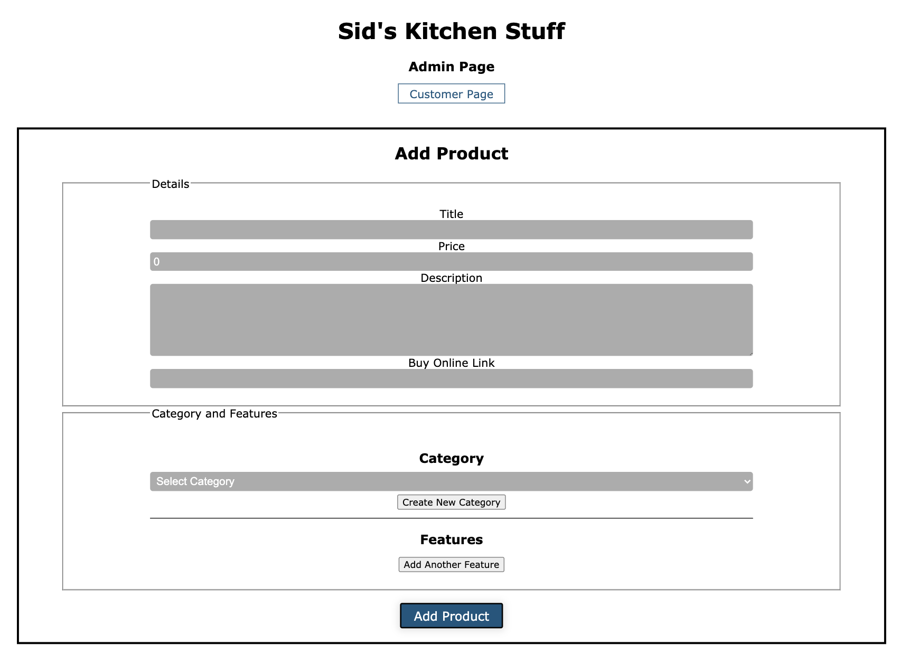
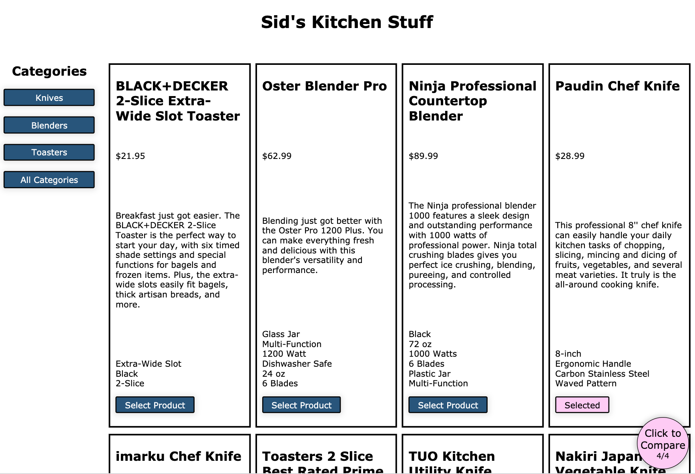
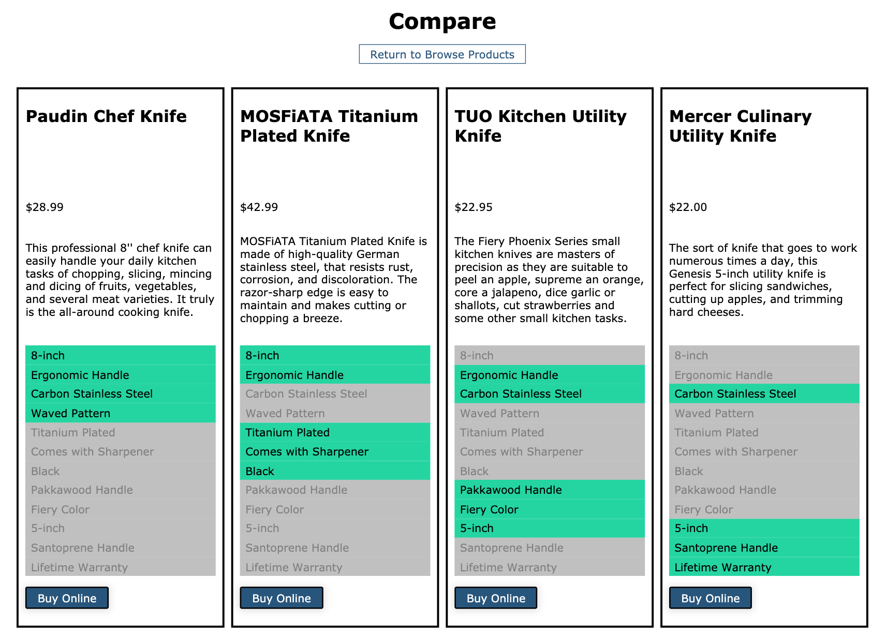

# Feather Report Client

### Summary
[Live Demo](https://featherreport.biz/)

API server: [Feather Report Server](https://github.com/Tarv44/feather-report-server).

This is my second fullstack project that I've built. It provides a straightforward platform for small businesses to upload products and give their customers a useful compare tool.

### Technology used:
* React
* CSS
* Node

***

